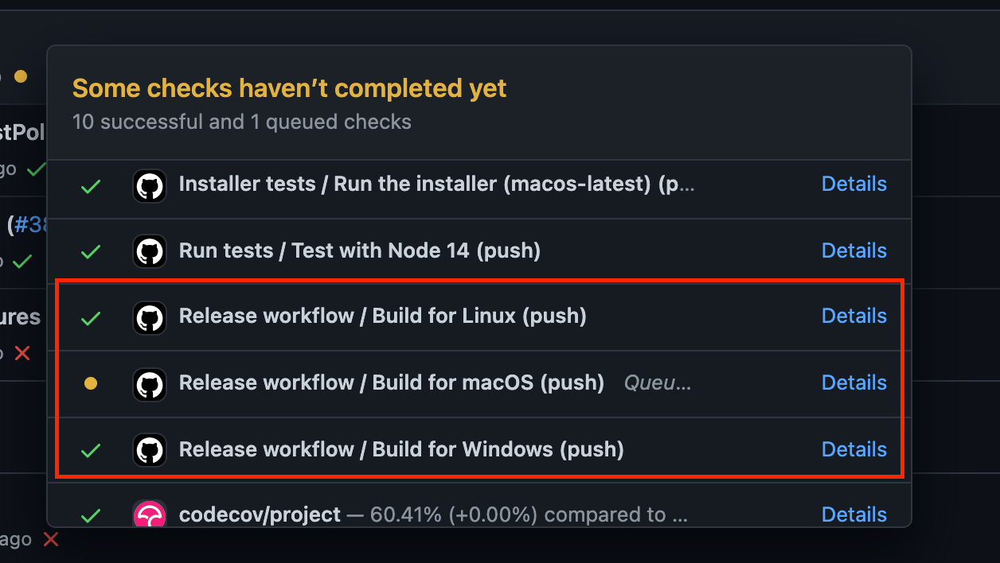
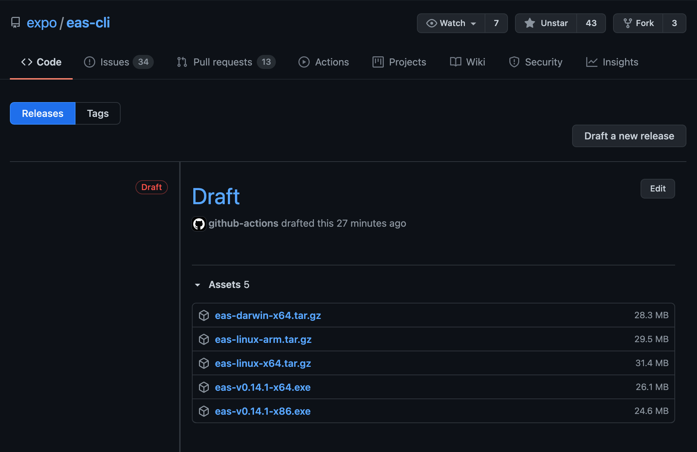
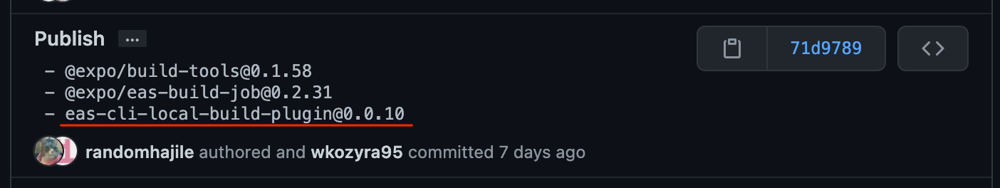

## Releasing a new version

1. Run `yarn release` in the repository root folder. This will create a new tag like `v1.0.0`.
1. **Wait until the `release` GitHub workflow has finished.**
   
1. Once the release is ready to go, you can go to https://github.com/expo/eas-cli/releases and mark it as not draft.
   - Remember to copy the changelog entries from `CHANGELOG.md`.
   - Before hitting the submit button, make sure there are 5 assets available under the release entry.
     
1. Run `yarn lerna publish from-git` in the repository root folder. This will publish the packages to npm.

   - This command works only if `HEAD` is on the release commit, e.g. when `git log -1` prints:

     ```
     commit cbb2de9e118bfbcb5a597b261d2dbef0bb5d4b0b (tag: v0.11.1)
     Author: Brent Vatne <brentvatne@gmail.com>
     Date:   Tue Apr 20 15:00:15 2021 -0700

         v0.11.1
     ```

   - If you run `yarn lerna publish from-git` on any other commit, it'll print something like:

     ```
     lerna notice from-git No tagged release found
     lerna success No changed packages to publish
     ```

   - If you ever run into the above issue, use `git checkout RELEASE_COMMIT_HASH` to checkout to the release commit. Later, when you've published the packages to npm, run `git checkout main` to go back to the latest commit.

1. Update `CHANGELOG.md`.
   - Add the new section with the release version in the title.
   - Leave the `main` section empty (without any changelog entries).
1. If any of the changelog entries have been tagged with `[EAS BUILD API]`
   - Open `package.json` and note the version of `@expo/eas-build-job` used in the eas-cli.
   - Find the `Publish` commit in [expo/eas-build](https://github.com/expo/eas-build/commit/) for that version. In most cases, it will be the latest `Publish` commit.
   - Find the `eas-cli-local-build-plugin` version published in that commit.
     
   - Run `npm dist-tags add eas-cli-local-build-plugin@VERSION latest` with the version from the previous step.
